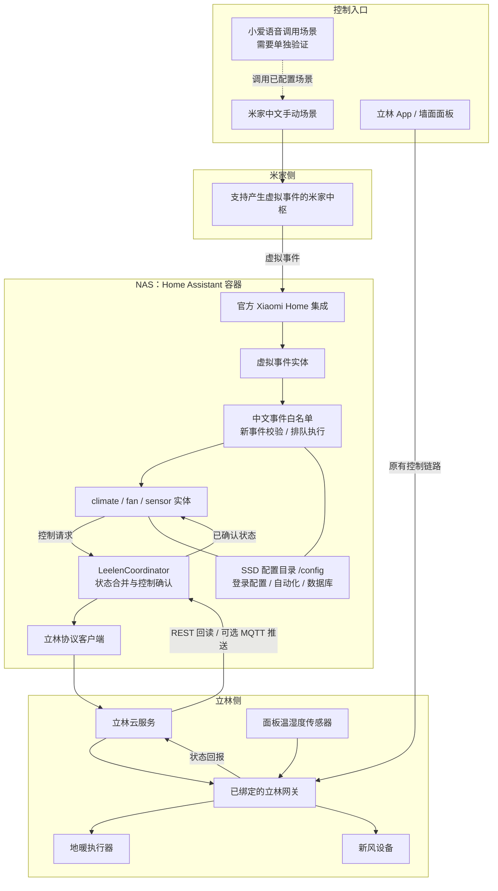
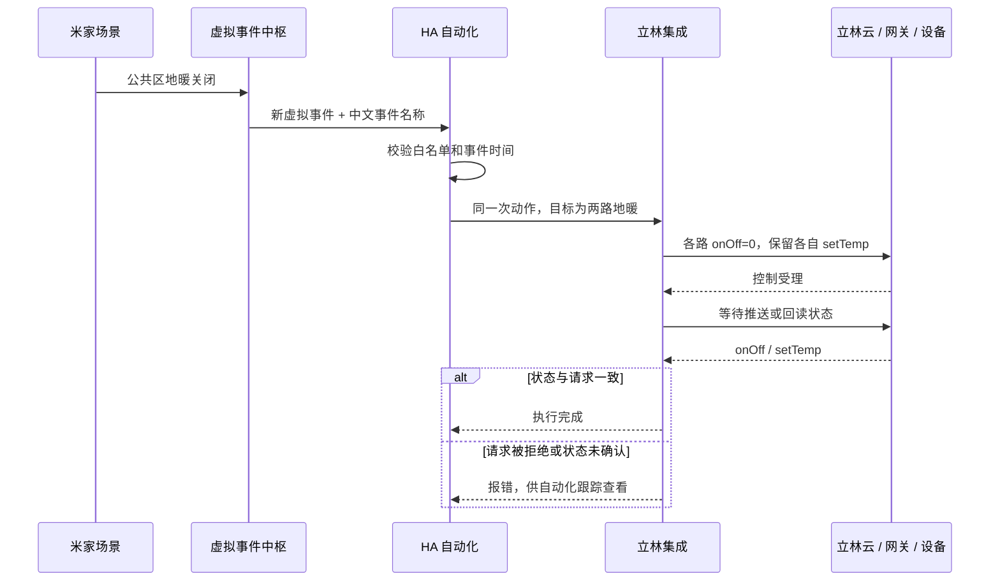

# Leelen Home：地暖、新风与米家联动

基于 [原工程 snailll2/leelen_home3](https://github.com/snailll2/leelen_home3) 的适配版本。
[本 fork](https://github.com/SeniorZhai/leelen_home3) 将立林地暖、新风和温湿度接入 Home Assistant（HA），再通过米家中枢的虚拟事件实现中文场景控制。

本文的设备名称、实体 ID 和分组均为匿名示例，不包含实际家庭配置。代码可以复用，示例中的实体 ID 必须按自己的 HA 实例替换。

## 方案与边界

- HA 负责设备状态、地暖温度、新风控制和自动化执行。
- 米家提供“开启／关闭”中文场景；支持的设备可以把同一场景交给小爱调用。
- 示例为四组地暖：区域 A、区域 B、区域 C、公共区；公共区包含两路，接收同一开关命令，各自保留目标温度。
- 新风提供开启、关闭两个场景，开启沿用设备当前风档。
- 已有 VRF 空调继续使用原控制链路。本适配不要求改动它。

这条链路提供的是**米家场景控制**，不会把 HA 地暖自动变成米家的原生温控器卡片，也不会把 HA 温湿度读数反向同步到米家。完整调温、状态查看仍在 HA 中完成。

## 架构



图中的连线表示逻辑链路，不代表所有通信均走局域网。立林接入依赖云服务；米家侧的可用传输方式由 Xiaomi Home 集成和中枢能力决定。NAS 与中枢需要持续在线。



双路联动表示同一次 HA 动作下发到两个实体，不是设备端原子事务；其中一路失败时，另一路可能已经执行，应检查两路状态。米家显示场景执行成功，也不等于立林设备已经完成动作。

## 本版本的适配

| 部分 | 实现与原因 |
| --- | --- |
| 设备发现 | 按逻辑服务区分地暖、空调、新风与面板传感器，避免仅按物理设备类型漏掉实体 |
| 地暖 | `49415` 只发送设备支持的 `onOff`、`setTemp`；去掉空调专用的 `mode`、`windSpeed`，修复设备永远无法确认这些字段的问题 |
| 新风 | `49412` 使用实际回报的 `gear` 字段读取、设置风档；单独开关只发送 `onOff` |
| 状态同步 | 首次 REST 读取；无 MQTT 时每 30 秒同步；MQTT 连接后改为每 5 分钟 REST 兜底 |
| 控制确认 | 检查云端受理结果，再等待推送或主动回读；未确认则报错，不提前把请求值当作设备状态 |
| 缺失数据 | 温度等未读到时保持未知，刷新失败时实体不可用 |
| 中文联动 | 场景名称与虚拟事件内容一致，事件必须在白名单中；使用队列处理连续开关 |
| NAS 部署 | 官方 HA 容器配合独立 `/config` 持久目录；配置、数据库可放 SSD，镜像仍遵循 Docker 引擎的存储设置 |

主要代码入口：

- [设备发现](custom_components/leelen_home3/device_catalog.py)、[状态与确认](custom_components/leelen_home3/coordinator.py)
- [地暖与空调](custom_components/leelen_home3/climate.py)、[新风](custom_components/leelen_home3/fan.py)、[传感器](custom_components/leelen_home3/sensor.py)
- [回归测试](tests/test_platform_setup.py)

## 安装

本适配验证环境为 **Home Assistant 2026.9.1 / Linux ARM64 NAS**。其他版本与硬件需要自行验证，不能仅凭安装成功判断控制可用。

### 官方容器：本方案使用的方式

已有 HA 时直接安装集成，不需要再创建一个实例。新建实例可以使用仓库中的 [compose.yaml](compose.yaml)：

1. 把部署目录放到目标磁盘；要让数据库落在 SSD，就把该目录放在 SSD。
2. 在该目录创建仅供本地使用的 `.env`：

   ```dotenv
   LEELEN_IMAGE=ghcr.io/home-assistant/home-assistant:2026.9.1
   ```

3. 将 `compose.yaml` 放入部署目录，并复制集成：

   ```sh
   mkdir -p config/custom_components/leelen3
   cp -R /path/to/leelen_home3/custom_components/leelen_home3/. config/custom_components/leelen3/
   docker compose up -d
   ```

4. 用浏览器打开 NAS 的 HA 服务端口 `8123`，完成账号初始化。
5. 在“设置 → 设备与服务 → 添加集成”搜索 **Leelen Home3**，使用立林账号的手机号和短信验证码登录。不要把验证码或令牌写进仓库。

源代码目录是 `custom_components/leelen_home3`，但运行时 domain 是 **`leelen3`**，所以安装目录必须是 `config/custom_components/leelen3`。启动时 HA 会安装 manifest 中声明的依赖。

Compose 使用 Linux `host` 网络和 `unless-stopped` 重启策略。更新集成前备份 `/config`，替换集成文件后重启 HA；不要删除、重新初始化原有配置目录。

### 可选：自建集成镜像

[Dockerfile](Dockerfile) 将集成放入镜像，并在首次启动时连接到 `/config/custom_components/leelen3`。已有手动安装目录会被保留，不会被镜像自动覆盖。

GitHub Actions 在代码推送时执行测试和启动检查；只有手动运行 **Publish Home Assistant image** 工作流才发布镜像。镜像是否可用以工作流和包页面为准，本 README 不保证已有可拉取的镜像。

使用自建镜像时，将 `LEELEN_IMAGE` 设置为已成功发布的固定 `sha-` 标签或 digest。切换前备份手动安装目录，确认是否需要移走它；否则容器仍会加载原来的手动版本。

## 配置米家控制

### 前提

- 已在 HA 安装并配置[官方 Xiaomi Home 集成](https://github.com/XiaoMi/ha_xiaomi_home)。
- 米家中枢实际支持“产生虚拟事件”，并在 HA 中出现对应的事件实体。此能力不是所有米家设备都有；不支持时不能直接套用本方案。
- HA 中的立林设备已可用，并与原 App、面板的设备名称及状态核对一致。

### HA 自动化

提供两份与本方案对应的匿名模板：

- [地暖四组开关](examples/mijia-floor-heating.yaml)
- [新风开关](examples/mijia-fresh-air.yaml)

在 HA 新建空白自动化，切换到 YAML 编辑，粘贴一个文件的完整内容；每份模板创建一个自动化。不要把单个自动化对象直接覆盖整个 `automations.yaml`。

粘贴前替换以下占位实体：

| 示例实体 | 替换内容 |
| --- | --- |
| `event.example_virtual_event` | 自己中枢的“虚拟事件发生”事件实体 |
| `fan.example_fresh_air` | 实际新风实体 |
| `climate.example_zone_a/b/c` | 三个独立地暖区域的实际实体 |
| `climate.example_common_1/2` | 需要同开同关的两路实际地暖实体 |

事件类型 `虚拟事件发生` 和属性 `事件名称` 必须与自己的 Xiaomi Home 事件实体一致。模板只接受白名单中的中文内容，忽略重复时间戳和超过 10 秒的旧事件。改名时需要同时修改米家内容与 HA 白名单。

### 米家中文场景

在“智能 → 我的智能”中新建“手动控制”，添加动作：选择自己的中枢 → 产生虚拟事件 → 输入事件内容。

| 手动场景名称 = 虚拟事件内容 | 行为 |
| --- | --- |
| 新风开启 / 新风关闭 | 新风开关，开启沿用当前风档 |
| 区域甲地暖开启 / 区域甲地暖关闭 | 控制区域 A |
| 区域乙地暖开启 / 区域乙地暖关闭 | 控制区域 B |
| 区域丙地暖开启 / 区域丙地暖关闭 | 控制区域 C |
| 公共区地暖开启 / 公共区地暖关闭 | 同时控制公共区两路，保留各自目标温度 |

一共 10 个手动场景。名称、虚拟事件内容和可填写的说明都可以用中文；代码实体 ID 与协议字段不需要翻译。

如需小爱控制，先确认该账号、音箱和米家版本能够调用这些手动场景，再逐条测试中文唤起。示例名称不是已经验证的语音口令。温度查询、调温、风档调节没有包含在这 10 个米家场景中。

## 验证情况与限制

| 项目 | 当前验证结论 |
| --- | --- |
| 官方容器、SSD 配置持久化、重启加载 | 已验证 |
| 米家虚拟事件传入 HA | 已验证 |
| 修复后的四组地暖关闭 | 通过中枢虚拟事件验证，双路目标均已确认 |
| 新风开启、关闭 | 已通过真实设备状态确认 |
| 地暖开启与设置温度 | 回归测试覆盖；本轮未完成全部区域的现场加热、调温验收 |
| 新风中、高档 | 尚未完成验证；中档曾出现未确认，不应声称三个风档全部可用 |
| 小爱语音唤起 | 尚未实测 |
| 米家原生温控卡片、反向同步温湿度 | 本方案不提供 |

新风代码目前将 `gear` 的 `0/1/2` 对应低／中／高档（33／66／100%），这是待按具体设备进一步验证的映射，不是全型号兼容承诺。公共示例只提供新风开关。

云端控制确认通常需要等待；本次单次开关确认约 20 秒，连续指令排队会更久。请查看 HA 自动化“跟踪”的最终结果，避免因为米家按钮已响应就反复点击。掉线、延迟或设备型号差异仍可能导致失败。

复查流程：记录原状态与目标温度 → 单组验证 → 查看设备回报与 HA 跟踪 → 核对双路分组 → 恢复原设置。温湿度正常显示不代表控制已经通过，模拟测试也不替代现场验收。

本地回归检查：

```sh
python3 -m unittest discover -s tests -t .
```

## 隐私与公开范围

- 只发布通用代码、匿名示例和架构说明；不发布生产自动化导出、家庭布局、截图、诊断日志或设备清单。
- `.env`、`config/`、`.storage/`、数据库、备份、本地 AI 配置不应进入 Git 或镜像构建上下文。
- 登录令牌、手机号、家庭组标识、设备地址、中枢事件实体中的账号标识和私有网络地址，只留在自己的 HA/NAS 上。
- 提交问题前先脱敏日志；上游调试日志可能包含账号或设备元数据，不要直接整份上传。
- 本 fork 保留上游历史。本次去除公开快照中的本地配置，不代表已改写或清除了上游历史中的所有内容。

问题请提交到[本 fork 的 Issues](https://github.com/SeniorZhai/leelen_home3/issues)，附版本、匿名设备类型、简化复现步骤和脱敏错误信息。
